# Code Walkthrough

A guided code review that helps you understand a change, inspect the evidence, and decide whether it is ready to merge or push. This guide explains all 12 walkthrough steps with screenshots; numbering matches the skill.

## Getting started

Invoke `$code-walkthrough` and choose either your current staged and unstaged changes or a named branch. A branch is reviewed against its Git merge base without switching your checked-out worktree. You can also supply a ticket link and say whether you are reviewing a pull request or preparing to push.

Ticket details are retrieved through a matching configured MCP connector. If the ticket cannot be retrieved, the walkthrough continues with that limitation stated explicitly.

The walkthrough presents one step at a time. Reply **next** to continue, or ask a question to discuss the current step without advancing. The changed-file review pauses after each group of two or three files.

The screenshots illustrate one review, not conclusions about your repository. The workflow distinguishes inspected code, ticket requirements, executed tests, and inference. See [SKILL.md](SKILL.md) for the full instructions.

## 1. Requirements and acceptance criteria

Establish what problem the change solves, how the proposed solution addresses it, and the observable acceptance criteria. This step also states the review scope and the source of the requirements. Without a ticket, inferred requirements are identified as such rather than presented as confirmed intent. If an evidence map is useful, it appears here after the acceptance criteria, using readable source descriptions rather than reference markers.

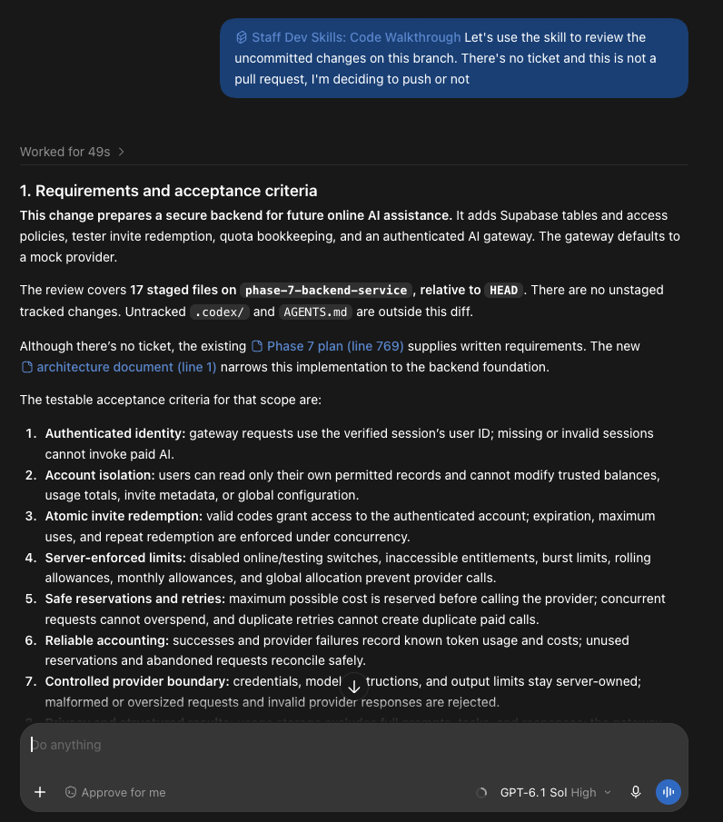

## 2. Test evidence

Establish what verification evidence is available by inspecting changed tests, relevant existing tests, CI results, and test logs. When clear, targeted, safe test commands are available, run the smallest relevant checks and report each exact command and result. Distinguish tests actually executed during the review from supplied results or tests only inspected in code. If a check cannot be run, explain why and identify the missing evidence; do not install dependencies, access production, or run destructive commands just to obtain a result. This step records the evidence; step 7 evaluates coverage and recommends tests for the remaining gaps.

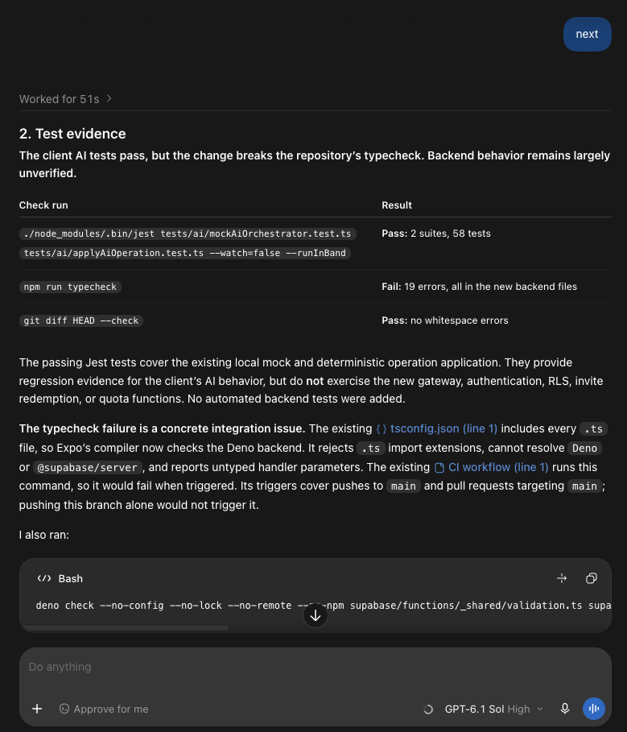

## 3. Code design

Explain the components, their responsibilities, and the interfaces between them before diving into individual files. Mermaid class or sequence diagrams are included when they make the design easier to understand. The example uses a class-style diagram to distinguish the gateway, usage adapter, and request/response contracts.

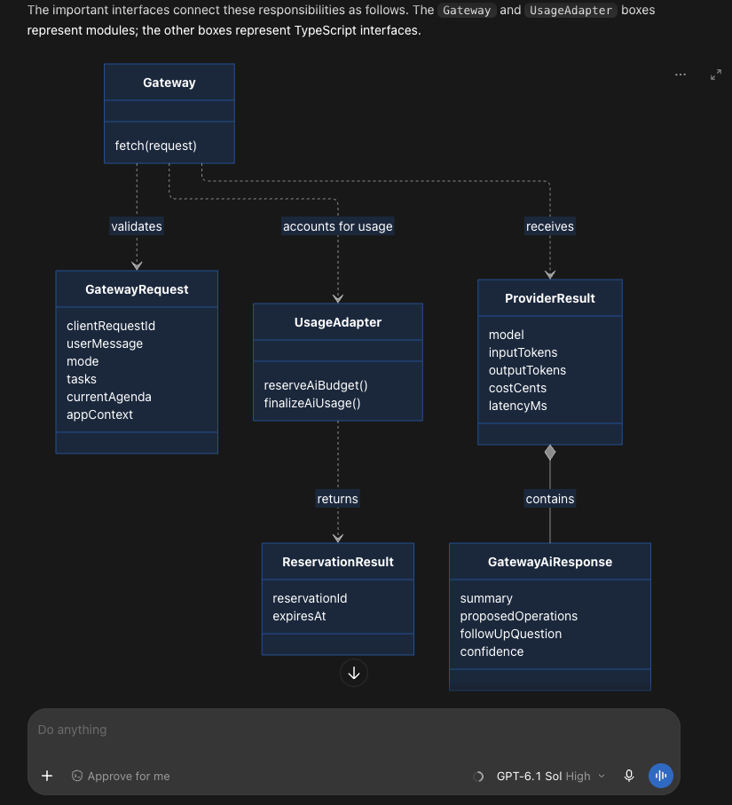

## 4. Affected end-to-end flow

Follow a representative journey from its trigger to its observable result, including relevant decision points and failure paths. A Mermaid flowchart accompanies the explanation so you can see how the pieces fit together. The walkthrough distinguishes a path supported by code from one demonstrated by an integration test.

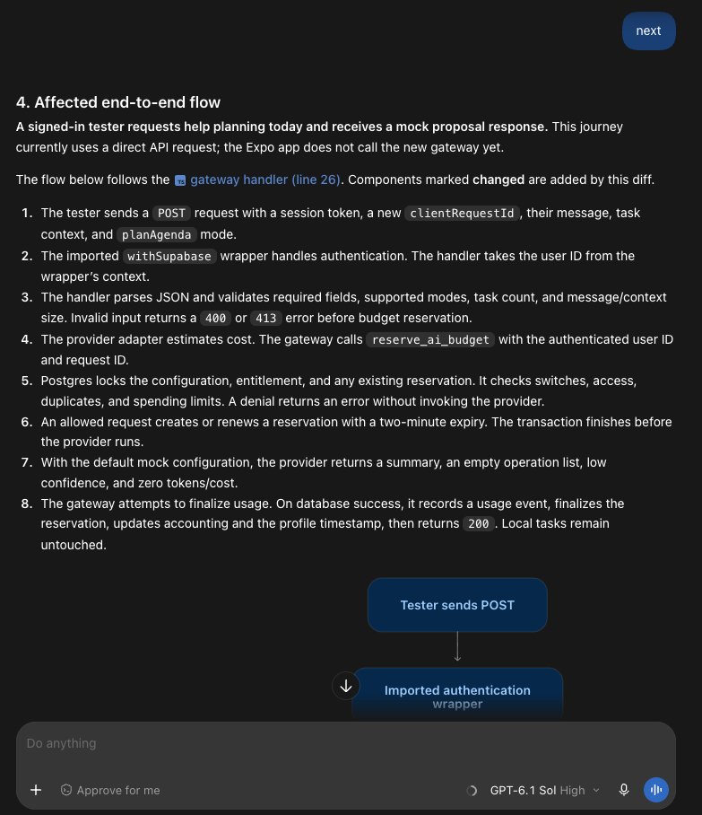

## 5. Changed files in logical order

Review every changed file once, ordered by its role in the end-to-end flow rather than alphabetically. Files are presented in groups of two or three, numbered **5.1**, **5.2**, and so on, with a pause between groups.

Each file explanation describes what changed and why, then shows relevant syntax-highlighted code inline. Modified code uses focused Before/After excerpts; new code shows the resulting implementation. Explanations and concerns sit next to the excerpts, without raw patch headers or `+`/`-` prefixes. The complete diff remains available for deeper inspection.

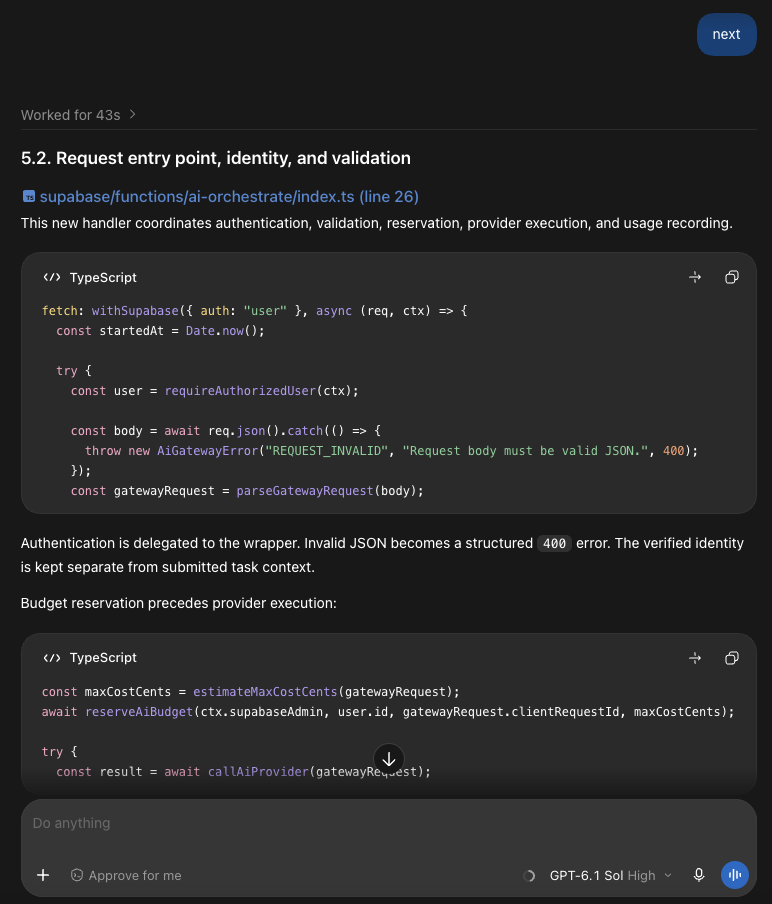

## 6. Correctness and behavior

Compare the implementation with the requirements and acceptance criteria established in step 1. Each criterion is assessed as met, contradicted, or unproven, with supporting evidence and relevant edge cases. Code that appears correct is not treated as verified runtime behavior when execution evidence is missing.

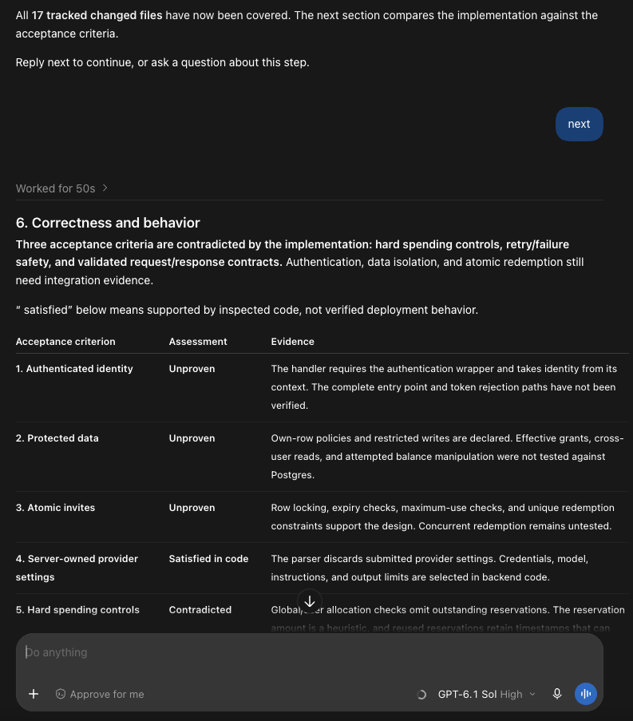

## 7. Test coverage and gaps

Identify which changed behaviors are covered and which still need tests, especially failure paths, boundaries, concurrency, and regressions. Recommend the smallest high-value additions and explain what each would establish. Passing tests for unrelated code do not count as coverage of the new behavior; missing tests and tests that could not be run are distinguished.

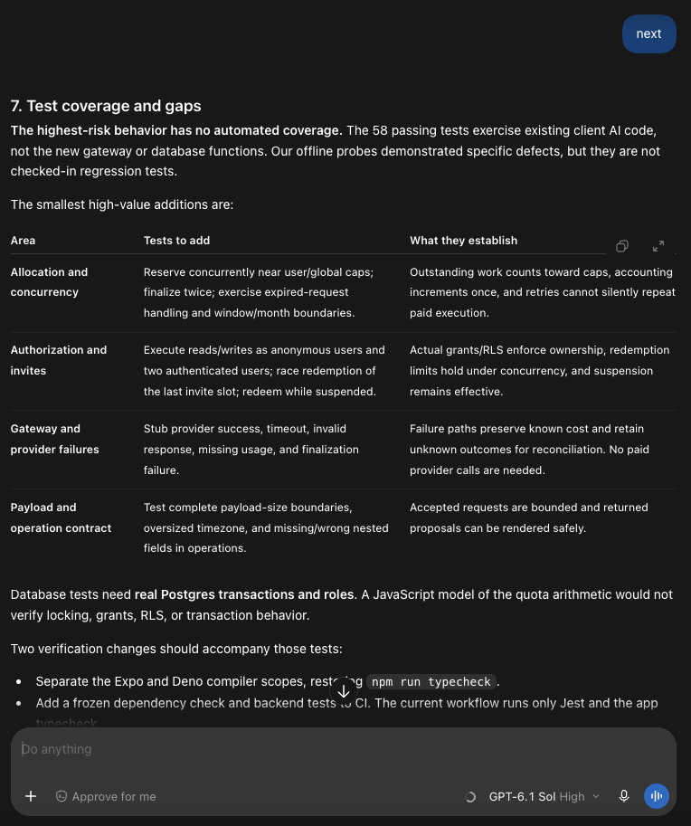

## 8. Performance and scale

Inspect potential regressions in database queries, locking, network calls, repeated processing, and resource use as load or data volume grows. Explain concrete risks and useful measurements without claiming an unmeasured slowdown as fact. The example connects a shared lock and an unindexed join to a recommended query-plan check.

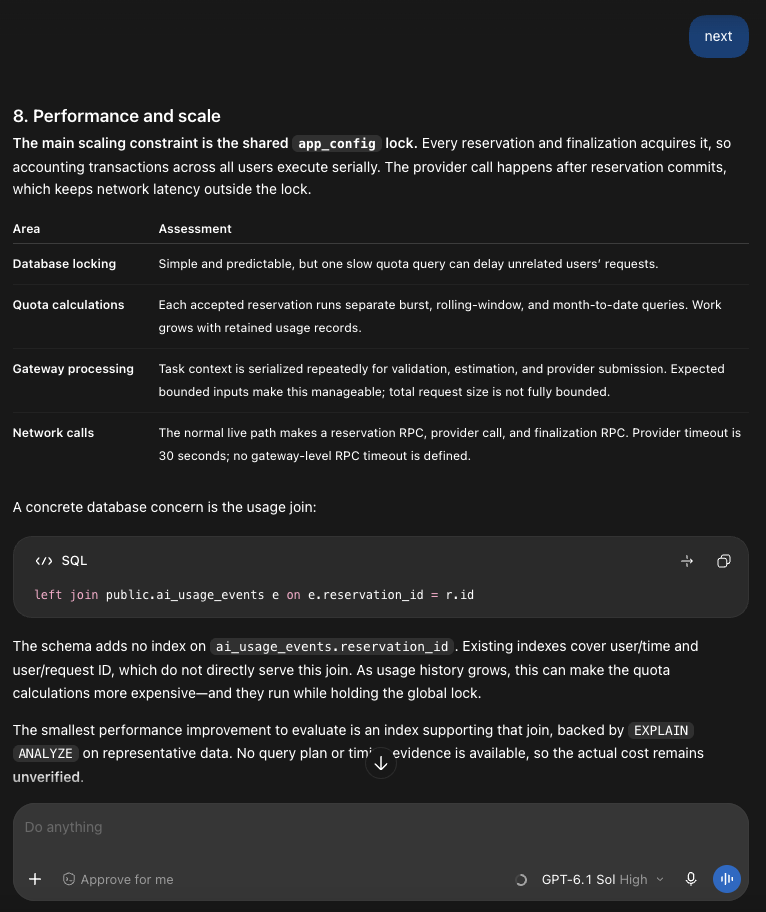

## 9. Readability and maintainability

Assess whether responsibilities, naming, control flow, types, and documentation make the code easy to follow and change safely. Call out concrete maintenance risks such as duplicated contracts, coupled failure paths, or comments that promise more than the implementation provides. Recommendations focus on practical improvements rather than stylistic preferences.

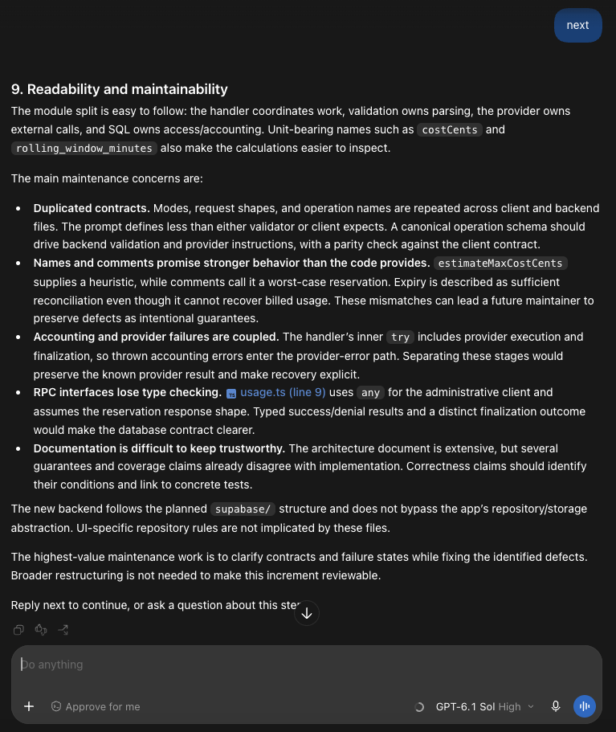

## 10. Security and compliance

Review relevant authentication, authorization, input validation, secrets, sensitive data handling, dependencies, and repository policies. State what was inspected, what raised a concern, and what remains unverified or is not applicable. A targeted check, such as scanning the diff for credentials, is not presented as proof of a complete security audit.

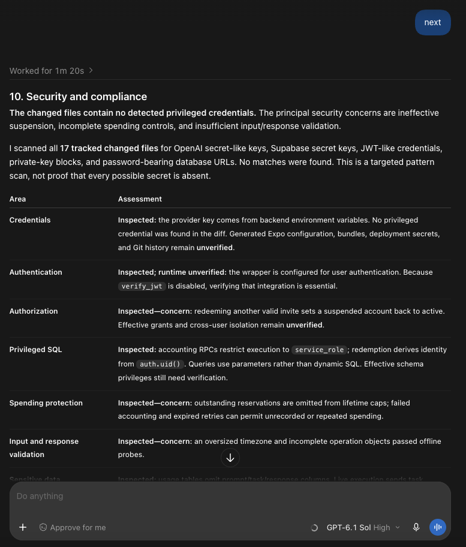

## 11. Review comments

Turn actionable findings into candidates for pull-request comments or requests to a coding agent. Each finding includes a priority, an exact file and line when available, evidence, impact, and a recommended resolution. The skill prepares these candidates but does not post comments or change code.

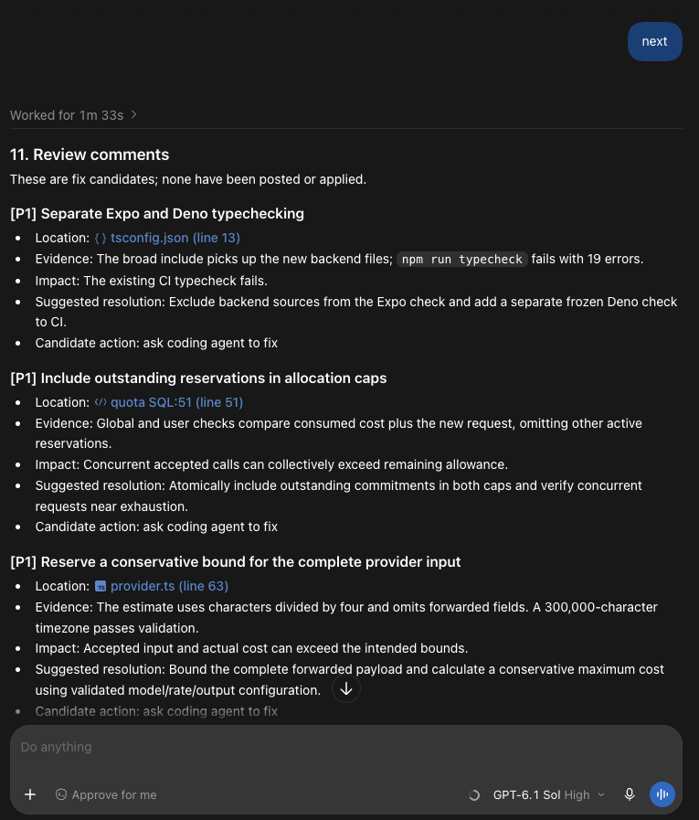

## 12. Checklist and final judgment

Summarize the review areas as **Pass**, **Concern**, **Unverified**, or **Not applicable**, then give a clear decision. Pull-request reviews end with **Approve** or **Hold**; reviews before pushing end with **Ready to push** or **Fix before pushing**. The judgment identifies the minimum corrective actions or verification needed, without allowing unrelated passing checks to hide unresolved blockers.

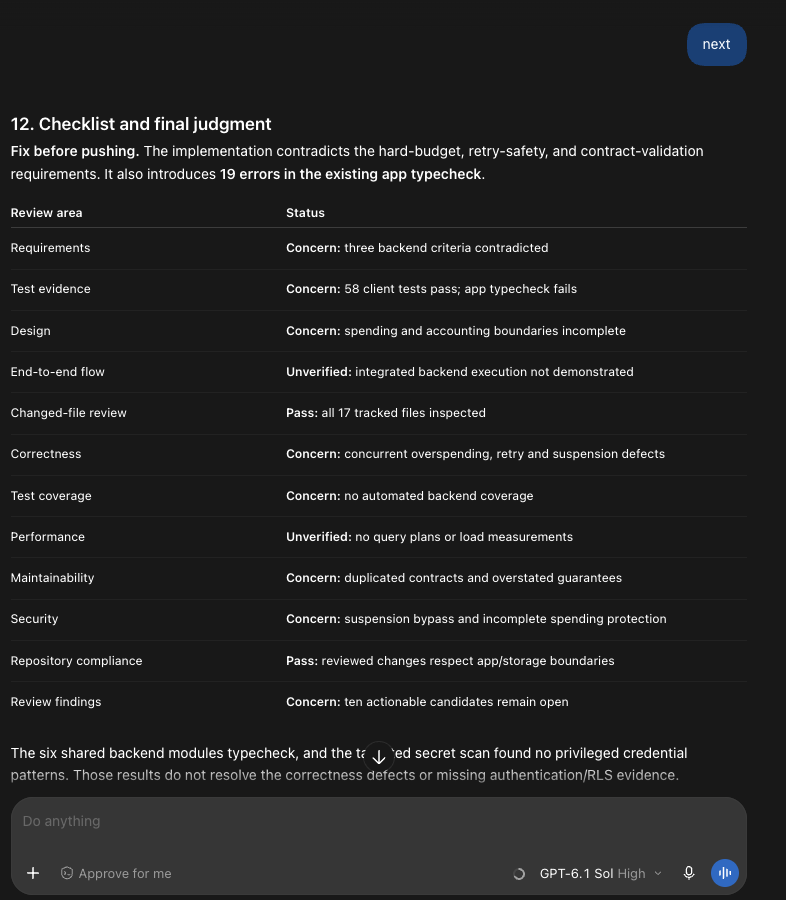
